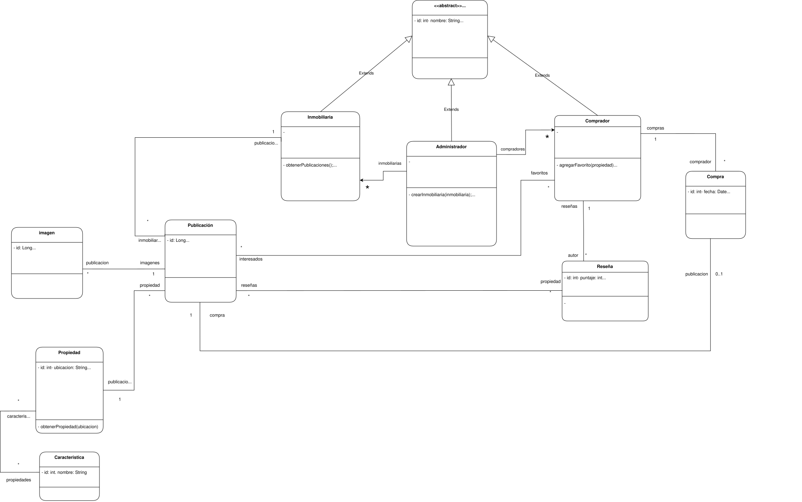

# Compra Tu Hogar

Plataforma integral para la gestión de bienes raíces (publicaciones, favoritos, compras y reseñas).

## 🛠️ Tecnologías y Herramientas

* **Backend:** Spring Boot, Java, MySQL.
* **Frontend:** React, Typescript, Vite.
* **Infraestructura:** Docker, Docker Compose, Docker Hub (Registry).

## 📐 Arquitectura y Diseño

A continuación se detalla la estructura y relación de los componentes del sistema:



---

## 🚀 Infraestructura (Despliegue Rápido / Producción)

Esta es la forma recomendada para clientes o para levantar la aplicación completa (DB + Backend + Frontend) utilizando las imágenes ya compiladas desde Docker Hub, sin necesidad de compilar el código localmente.

### Requisitos

* Docker y Docker Compose instalados.

### Pasos para ejecutar

1. **Configurar variables de entorno:**
   Copiá el archivo de ejemplo para crear tu entorno de configuración.

```bash
cp .env.example .env
```

2. **Levantar los servicios:**
   Ejecutá el `docker-compose` de producción. Esto descargará las imágenes del registry y levantará todos los contenedores en segundo plano.

```bash
docker compose -f docker-compose.prod.yml up -d
```

3. **Verificar el estado:**
   Comprobá que el backend está respondiendo correctamente (no requiere autenticación).

```bash
curl -s http://localhost:8080/api/v1/health
```

### Comandos de gestión

#### Apagar la aplicación

```bash
docker compose -f docker-compose.prod.yml down
```

#### Resetear la base de datos (Borrar volúmenes)

> ⚠️ Advertencia: Esto eliminará todos los datos guardados en MySQL.

```bash
docker compose -f docker-compose.prod.yml down -v
```

---

## ⚙️ Backend (Entorno de Desarrollo)

API REST para la lógica de negocio.

* **Base path:** `http://localhost:8080/api/v1`
* **Healthcheck:** `GET /health`

### Levantar el entorno local (Build desde el repositorio)

Si vas a desarrollar o modificar el código del backend, podés compilar la imagen localmente.

1. **Configurar variables**

```bash
cp .env.example .env
```

2. **Levantar DB + Backend local**

```bash
docker compose up -d --build
```

> Nota: El archivo `docker-compose.yml` base incluye un servicio de frontend que asume que tenés el repositorio clonado en `../Compra-tu-Hogar-frontend`.

### Variables de Entorno (Backend)

Definidas en `.env.example`:

* `DB_URL`: JDBC URL (en Compose usar: `jdbc:mysql://db:3306/<DB_NAME>`)
* `DB_USER` / `DB_PASSWORD`: Credenciales de la base de datos.
* `MYSQL_ROOT_PASSWORD`: Contraseña root (solo utilizada por el contenedor de MySQL).
* `JWT_SECRET_KEY`: Clave secreta para firmar tokens (mínimo 32 caracteres, algoritmo HS256).
* `JWT_EXPIRATION_TIME`: Tiempo de vida del token en milisegundos.

### Comandos útiles

Para ver los logs del backend en tiempo real:

```bash
docker compose logs -f backend
```

---

## 💻 Frontend (Entorno de Desarrollo)

*(TODO: Completar con la documentación específica del equipo de Frontend)*

* **Framework / Build Tool:** Vite (Puerto 5173).
* **Imagen Docker de Producción:** `bautistabracco/compra-tu-hogar-frontend`
* **Configuración de variables de entorno:** Explicar cómo apuntar el front al `http://localhost:8080/api/v1` del backend.
* **Comandos de desarrollo local:** Ej: `npm install`, `npm run dev`.
* **Ejecución aislada:** Explicar cómo correr únicamente la imagen del frontend si fuera necesario.

---

## 🌐 Resumen de Servicios y Puertos

| Servicio     | Puerto Local | Context Path / Ruta |
|--------------|--------------|---------------------|
| **MySQL**    | `3306`       | -                   |
| **Backend**  | `8080`       | `/api/v1`           |
| **Frontend** | `5173`       | `/`                 |
